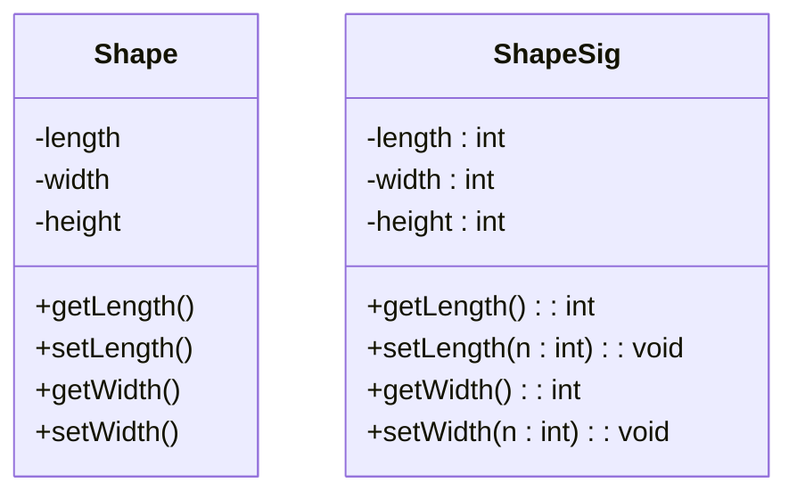
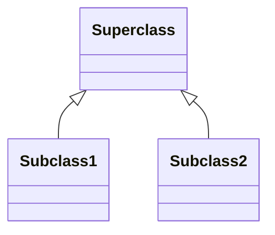

#sample UML diagram for CSC102 by Alexzander Rodriguez  
#alerodr1@uat.edu

Create a diagram with 2 classes. Those classes need 3 attributes/ properties, 3 methods

Attributes come before properties or methods  
\+ public, \- private, \# protected  

